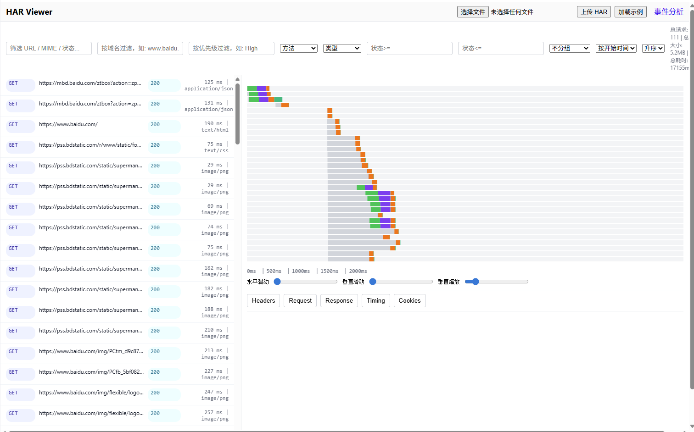
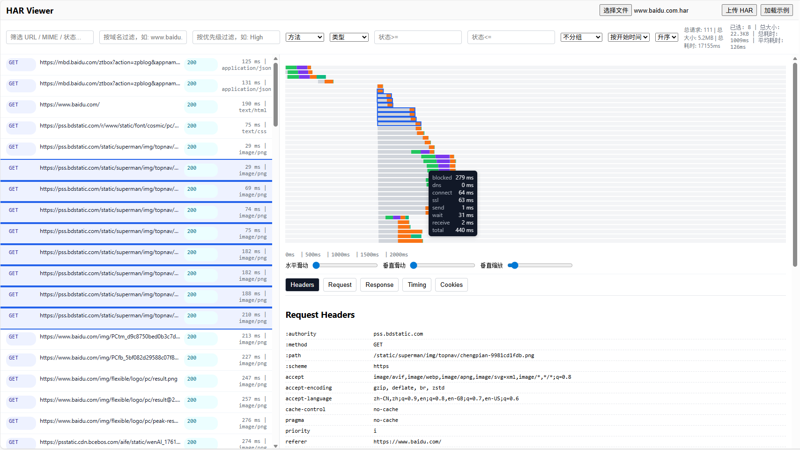
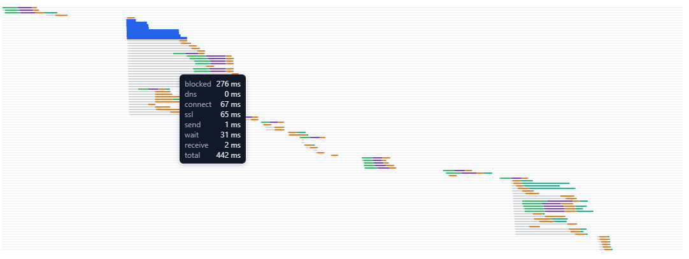
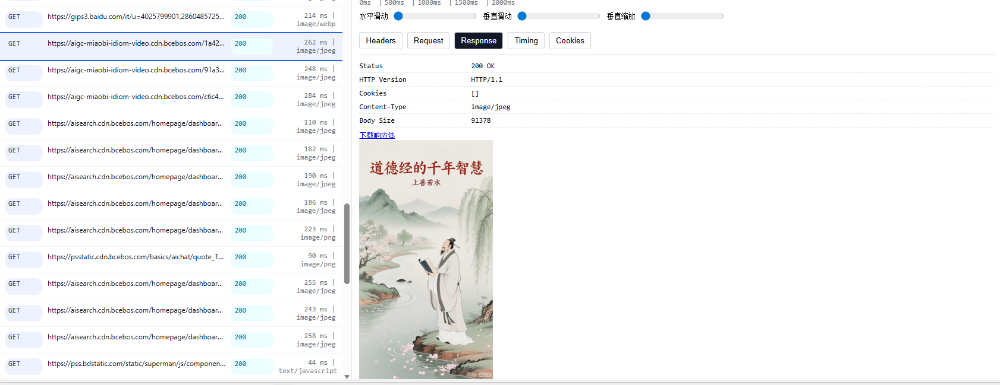
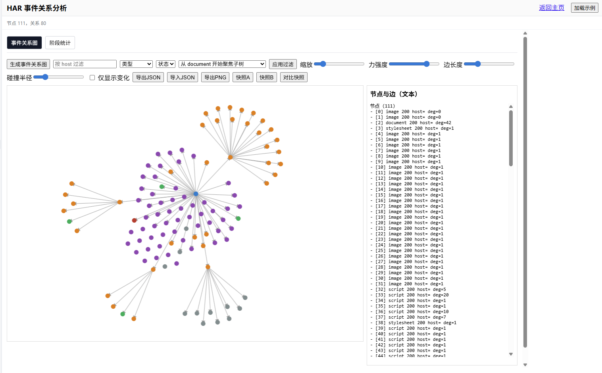
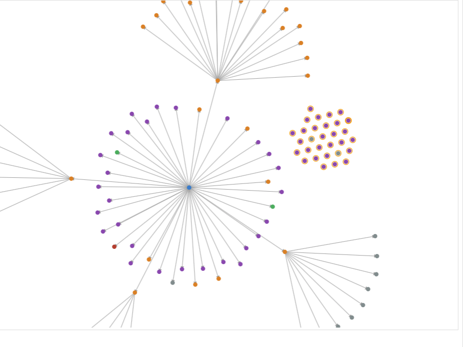
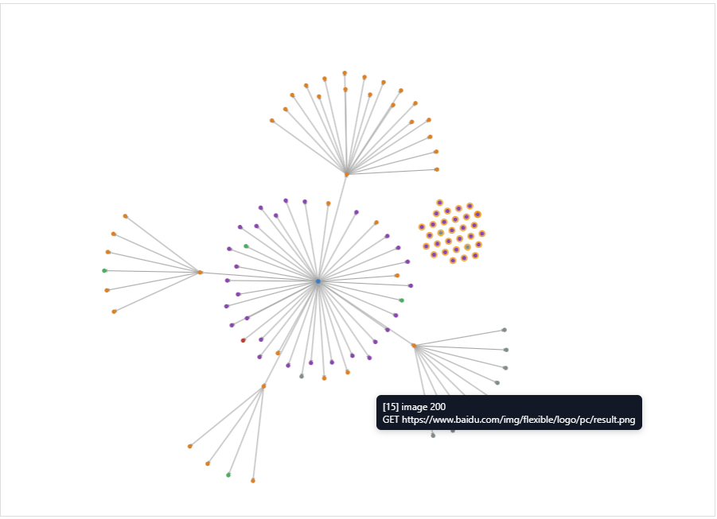
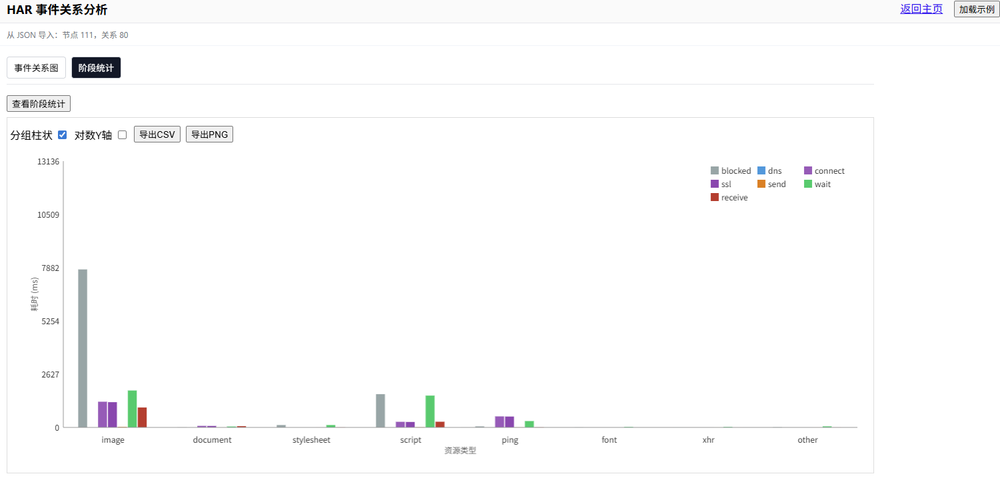
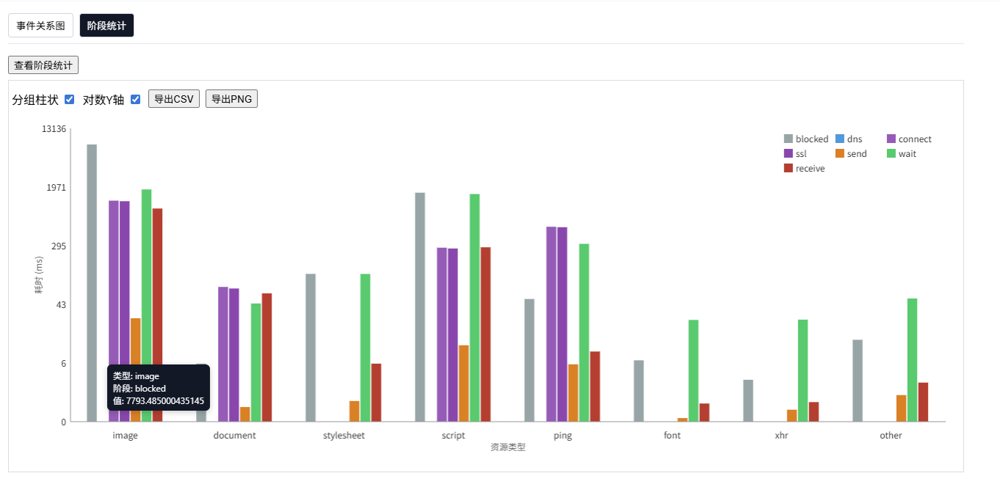

# HAR Analyzer / HAR Viewer

一个基于 FastAPI + 原生前端的 HAR 可视化分析工具。支持上传或加载示例 HAR，提供列表与瀑布图联动、筛选/分组/排序、批量选择、统计信息展示、响应体预览等功能。

## 功能特性

- HAR 文件管理
  - 上传 `.har` 文件并解析
  - 加载示例 HAR（内置 `www.baidu.com.har` 或 `har-analyzer-main/sample.har`）
- 过滤与排序
  - 关键字筛选（URL / MIME / 状态）
  - 域名、优先级、方法、类型、状态区间过滤
  - 按开始时间/耗时/大小排序，升降序切换
  - 按域名或类型分组展示
- 瀑布图交互
  - 自适应刻度标尺，刻度点击可选择最近条目
  - 鼠标滚轮缩放时间轴、拖拽横向平移
  - 水平/垂直滑动导轨（时间窗口与可视行窗口）
  - 垂直缩放：固定高度下最小档自动压缩行高，确保“所有行完全显示在画布内”；其他档位按滑杆值显示更大行高
  - 悬停提示各阶段耗时（blocked/dns/connect/ssl/send/wait/receive）
- 列表与画布联动
  - 单选条目：列表与瀑布图同步高亮
  - 批量选择：
    - Shift + 点击：选择上一主选项与当前项之间的连续区间
    - Ctrl/⌘ + 点击：逐个添加/移除选中项
  - 标尺范围框选：高亮重叠条目并同步到选中集合
- 统计信息
  - 总统计：总请求数、总大小、总耗时（后端 `/api/stats`）
  - 已选统计：所选集合数量、总大小、总耗时、平均耗时（前端实时计算）
- 响应详情
  - Headers / Request / Response / Timing / Cookies 标签页
  - 响应体预览（支持图片 base64 DataURL、文本截断预览、下载）

## 实际效果截图


















## 目录结构

```
├── requirements.txt
├── server
│   ├── __init__.py
│   ├── har_utils.py          # HAR 解析与数据整理、统计构建
│   └── main.py               # FastAPI 路由与页面渲染
├── static
│   ├── app.js                # 前端主逻辑（列表、瀑布图、交互、统计）
│   └── styles.css            # 样式定义
├── templates
│   └── index.html            # 页面模板
├── uploads
│   └── www.baidu.com.har     # 上传目录中示例文件（若存在）
└── www.baidu.com.har         # 项目根示例文件（若存在）
```

## 环境与安装

- 依赖：
  - `fastapi==0.115.2`
  - `uvicorn==0.32.0`
  - `jinja2==3.1.4`
  - `python-multipart==0.0.9`
- 安装依赖：

```
python -m pip install -r requirements.txt
```

## 启动与访问

- 启动开发服务：

```
python -m uvicorn server.main:app --reload --port 8000
```

- 打开浏览器访问：

```
http://localhost:8000/
```

## 使用指南

- 导入数据
  - 点击「上传 HAR」选择本地 `.har` 文件，或点击「加载示例」加载内置示例
- 列表与筛选
  - 顶部筛选栏输入关键字或设置各筛选项；支持分组与排序
  - 点击列表条目查看详情；支持 Shift/Ctrl 批量选择
- 瀑布图
  - 鼠标滚轮：缩放时间轴（默认纵向滚轮）
  - 按住拖拽：横向平移时间窗口
  - 水平滑动导轨：快速调整时间窗口位置
  - 垂直滑动导轨：浏览当前固定高度下的可视行窗口
  - 垂直缩放滑杆：
    - 最小档位：自动计算最小行高以在固定高度 `canvas` 中完整显示所有行
    - 非最小档位：按滑杆值显示更高的行高（更清晰），超出可视窗口则用垂直滑动导轨浏览
  - 标尺刻度点击：选择覆盖该时间或最近的请求条目
  
### 事件页（关系图与阶段统计）
- 事件关系图：
  - 力导向布局，节点按资源类型着色，边按触发原因着色并绘制箭头；
  - 交互：缩放、拖拽、悬停提示、邻接高亮；
  - 多选与框选：
    - Ctrl + 点击：切换节点是否选中；
    - Shift + 拖拽：框选（替换/添加/移除模式，分别对应仅 Shift、Shift+Ctrl、Shift+Alt）；
    - Esc：清空选择；
  - 群拖拽：存在多选集合时，拖拽任一被选节点将整体移动所有被选节点；
  - 侧边栏文本面板：显示多选计数与所选节点列表（最多 100 条）。
- 阶段统计图：
  - 每类型分阶段耗时柱状图（blocked/dns/connect/ssl/send/wait/receive）；
  - 可切换「对数 Y 轴」以使用 `log1p` 缩放，小值更易比较；刻度通过 `expm1` 反变换显示；
  - 画布上绘制 X/Y 轴标题与阶段颜色图例；
  - 支持导出 PNG 与 CSV。
  - 悬停提示：查看条目各阶段耗时
- 统计信息
  - 「总统计」显示总请求数、总大小与总耗时
  - 「已选统计」显示当前选中集合的数量、总大小、总耗时与平均耗时
- 响应详情
  - 在详情区切换标签查看 Headers/Request/Response/Timing/Cookies
  - 支持响应体预览与下载

## API 说明

- `GET /api/stats`：返回总统计（`count`、`totalSize`、`totalTime`、分布字段）
- `GET /api/entries`：分页与筛选后的条目摘要列表
  - 支持参数：`offset`、`limit`、`q`、`domain`、`priority`、`method`、`type`、`statusMin`、`statusMax`
- `GET /api/entries/{id}`：条目详细信息（含各阶段耗时、请求/响应等）
- `GET /api/entries/{id}/body`：响应体预览信息（可能包含 base64 DataURL 或文本）
- `GET /api/entries/{id}/download`：下载响应体原始内容
- `POST /api/upload`：上传 HAR 并解析
- `GET /api/load-sample`：加载示例 HAR

## 开发说明

- 前端主入口：`static/app.js`，使用原生 DOM API
- 页面模板在 `templates/index.html`
- 样式在 `static/styles.css`，`canvas` 高度为固定值（默认 `240px`），最小倍率下前端自动压缩行高以适配所有行
- 提示：在 Windows 环境下路径包含中文也可正常运行，但建议使用 UTF-8 终端与编辑器

## 常见问题

- 垂直缩放“最小档”如何工作？
  - 在固定高度 `canvas` 下，最小档不直接使用滑杆值，而是按总行数计算最小行高 `minRowH = floor((视口高度 - 内边距)/总行数)`，保证所有行完整显示
- 批量选择不生效？
  - 请确保先选中一个主项，再使用 Shift 选择区间或 Ctrl/⌘ 逐个切换；列表与瀑布图会同步高亮
- 示例文件未加载？
  - 请确认项目根目录或 `uploads/` 下存在示例 HAR；否则使用上传功能

## 贡献

欢迎提交 Issue 或 PR 来改进功能与交互。如果你希望增加统计维度（例如按域名分布、Top N 慢请求），或者支持导出选中集合为 CSV/JSON，请在 Issue 中描述你的需求。

---

# English Version

HAR Analyzer / HAR Viewer is a FastAPI + vanilla JS application to visualize and analyze HAR files. It supports uploading or loading a sample HAR, interactive waterfall chart, list–canvas linking, filtering/grouping/sorting, multi-selection, selection statistics, and response preview.

## Features

- HAR management
  - Upload `.har` and parse
  - Load sample HAR (`www.baidu.com.har` or `har-analyzer-main/sample.har`)
- Filtering & sorting
  - Keyword filter (URL / MIME / status)
  - Domain, priority, method, type, status range filters
  - Sort by start time / duration / size, ascending or descending
  - Group by domain or resource type
- Waterfall interactions
  - Adaptive ruler ticks; click tick to select nearest entry
  - Mouse wheel zoom on timeline; drag to pan horizontally
  - Horizontal/vertical sliders to navigate time window and visible rows
  - Vertical zoom: with fixed canvas height, the lowest zoom compresses row height to display all rows; other zoom levels use the slider value for clearer rows
  - Hover tooltip showing phase timings (blocked/dns/connect/ssl/send/wait/receive)
- List–canvas link
  - Single selection: both list and canvas highlight
  - Multi-selection:
    - Shift + click: select a contiguous range between the last anchor and current
    - Ctrl/⌘ + click: toggle individual items
  - Range selection on ruler: highlight overlapping bars and sync selection
- Statistics
  - Total statistics (from backend `/api/stats`): request count, total size, total time
  - Selection statistics (frontend): selected count, total size, total time, average time
- Response details
  - Tabs: Headers / Request / Response / Timing / Cookies
  - Response preview (image base64 DataURL, truncated text preview, download)

## Directory Structure

```
├── requirements.txt
├── server
│   ├── __init__.py
│   ├── har_utils.py          # HAR parsing & stats builder
│   └── main.py               # FastAPI app & routes
├── static
│   ├── app.js                # Frontend logic (list, waterfall, interactions, stats)
│   └── styles.css            # Styling
├── templates
│   └── index.html            # Template
├── uploads
│   └── www.baidu.com.har     # Example file (if present)
└── www.baidu.com.har         # Example file (if present)
```

## Setup

Dependencies:

```
python -m pip install -r requirements.txt
```

## Run

```
python -m uvicorn server.main:app --reload --port 8000
```

Open `http://localhost:8000/` in the browser.

## Usage

- Import data via “Upload HAR” or “Load Sample”
- Filter/group/sort from the toolbar; click list items to view details
- Waterfall: wheel to zoom, drag to pan, sliders for horizontal/vertical navigation
- Vertical zoom: lowest level auto-compresses row height to show all rows in the fixed-height canvas; other levels use the slider value
- Selection: single click, Shift range, Ctrl/⌘ toggle; selection statistics update live

## API

- `GET /api/stats`: total statistics (count, size, time, distributions)
- `GET /api/entries`: paginated & filtered entry summaries
- `GET /api/entries/{id}`: entry detail
- `GET /api/entries/{id}/body`: response preview info
- `GET /api/entries/{id}/download`: download raw response body
- `POST /api/upload`: upload HAR
- `GET /api/load-sample`: load sample HAR

## Development Notes

- Frontend entry: `static/app.js` (vanilla DOM APIs)
- Fixed canvas height by CSS (default `240px`); at lowest vertical zoom the frontend compresses row height to fit all rows

## Screenshots


## Contributing

Issues and PRs are welcome. If you need extra statistics (e.g., domain distribution, Top-N slow requests) or exporting selected entries to CSV/JSON, please open an issue.